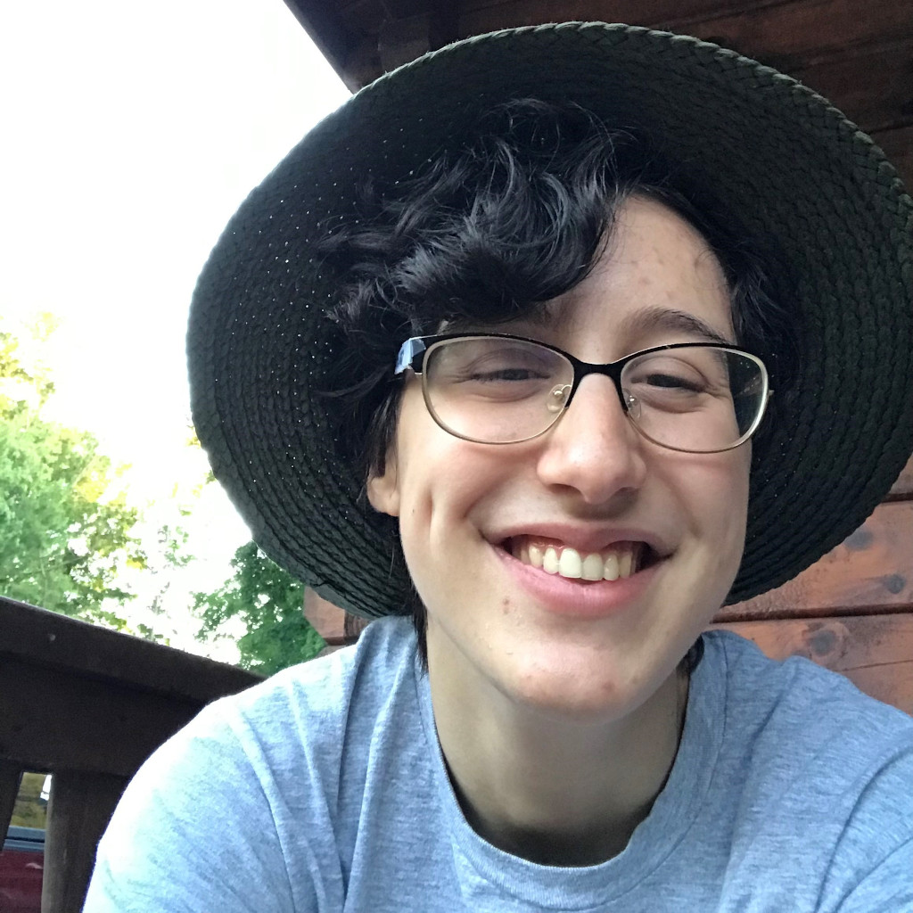

# About Me

Hi! My name is Robert, but friends usually call me Rob, and I'm a senior, full-time student here at New Paltz.

## Computer Science Experience

While I'm also interested in game and software development, learning CSS and HTML is what initially sparked my interest in computer science as a whole. That aside, I've had brief experience with PHP, JavaScript, and SQL through the Computer Science III course and independent learning, and alongside this course, I'm going to be working on the software engineering course's group project, and continuing small, personal projects like creating a program for playing chess and working on a choice-based narrative game with one of my best friends.

## Past This Course

I'm very interested in pursuing web development as a career, but even if I change paths, it's great to have the knowledge to create and manage a website for future endeavors. (I also already have a family member who asked if I could build a website to showcase her work once I'm finished with this course, which I would absolutely love to follow through on.)